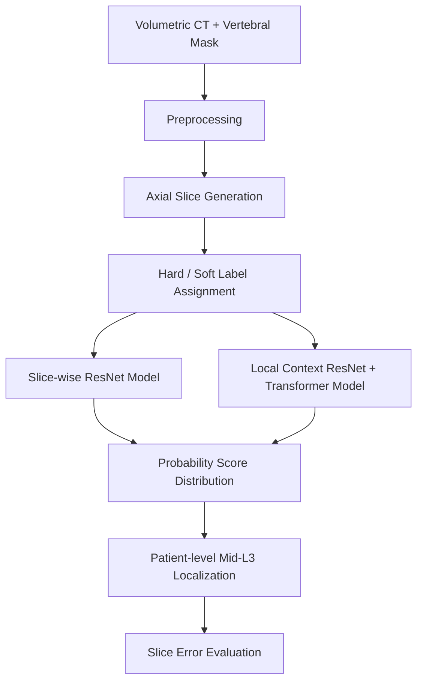

# CT Mid-L3 Localization with Slice-wise and Local Context Learning

This repository provides an implementation of a deep learning-based framework for automatic localization of the mid-third lumbar vertebral level (mid-L3) in axial computed tomography (CT) images.

The project is designed around two complementary modeling strategies:

1. **Slice-wise learning**: each axial CT slice is independently classified using a ResNet-based model.
2. **Local context learning**: neighboring axial slices are jointly used with a ResNet feature encoder and Transformer-based sequence modeling.

The main objective is to improve mid-L3 slice identification by combining **distance-aware soft labeling** with **local axial context modeling**.

---

<p align="center">
  
</p>


## 1. Background

The third lumbar vertebral level (L3) is widely used as a reference slice for CT-based body composition analysis, including skeletal muscle area and adipose tissue assessment. Manual identification of the mid-L3 slice can be time-consuming and observer-dependent, especially in large-scale retrospective CT studies.

This project formulates mid-L3 identification as an axial CT slice-level localization problem. Instead of relying only on manual slice selection or full volumetric segmentation, this repository explores practical slice-level classification models that can estimate the mid-L3 slice from a sequence of axial CT images.

---

## 2. Project Objective

The purpose of this project is to automatically identify the axial CT slice corresponding to the mid-L3 vertebral level.

This repository investigates the following questions:

- Can a CNN-based slice-wise model identify L3-related axial CT slices?
- Can soft labeling improve mid-L3 localization compared with conventional hard labeling?
- Which soft-labeling function is more suitable for mid-L3 localization?
- Can local axial context from adjacent slices improve localization performance?
- How accurately can the predicted mid-L3 slice be localized at the patient level?

---

## 3. Dataset

This project used the publicly available **CTSpine1K** dataset, which provides volumetric CT images and corresponding vertebral segmentation masks in NIfTI format.

Among the CTSpine1K subsets, the **COLONOG subset** was used because it contains anatomical L3 vertebral levels. Other subsets were excluded because most cases did not include the L3 level.

A total of **784 CT volumes** from the COLONOG subset were included in this study. The data were split patient-wise into training, validation, and test sets.

The vertebral segmentation mask was used to identify the L3 vertebral region. In the segmentation mask, the L3 vertebra was represented by label value `22`. The ground-truth mid-L3 slice was determined by calculating the center of gravity of the L3 mask.

Each saved axial slice was assigned one of the following labels:

```text
L3_mid  : ground-truth mid-L3 slice
L3      : slice within the L3 vertebral region
NL3     : non-L3 slice
```

### Dataset split

The dataset was split patient-wise into training, validation, and test sets.

| Split | Ratio |
|---|---|
| Train | 60% |
| Validation | 20% |
| Test | 20% |

### Slice labels

Each saved axial slice is assigned one of the following labels:

```text
L3_mid  : ground-truth mid-L3 slice
L3      : slice within the L3 vertebral region
NL3     : non-L3 slice
```

Due to dataset access and redistribution restrictions, raw CT volumes, segmentation masks, and processed image files are not included in this repository.

---

## 4. Preprocessing

The preprocessing pipeline consists of the following steps:

1. Load volumetric CT images and vertebral segmentation masks.
2. Reorient CT volumes into a consistent anatomical orientation.
3. Identify the L3 vertebral region from the segmentation mask.
4. Compute the center of gravity of the L3 mask.
5. Define the nearest saved axial slice as the ground-truth mid-L3 slice.
6. Apply CT intensity windowing.
7. Resize axial CT slices to a fixed image size.
8. Save axial slices at fixed intervals along the craniocaudal axis.
9. Assign hard or soft labels to each saved slice.

### Image preprocessing settings

| Item | Setting |
|---|---|
| Input modality | Axial CT |
| Image type | Single-channel 2D image |
| Intensity window | `[-160, 240]` |
| Input size | `256 × 256` |
| Slice sampling | Approximately 5 mm interval |

---

## 5. Labeling Strategy

Two labeling strategies are supported: **hard labeling** and **soft labeling**.

---

### 5.1 Hard Labeling

In the hard-label setting, each axial slice is assigned a binary target.

```text
L3_mid / L3 → 1
NL3        → 0
```

Hard labeling is suitable for binary L3-vs-non-L3 classification. However, it does not explicitly represent how close a slice is to the true mid-L3 location.

For example, an axial slice immediately adjacent to the mid-L3 slice and another slice far away from L3 may both be treated simply as `0` or `1`, depending on the binary class definition. This can be suboptimal for localization, where the anatomical distance from the reference slice is important.

---

### 5.2 Soft Labeling

In the soft-label setting, each slice is assigned a continuous target value according to its distance from the ground-truth mid-L3 slice.

Let `d` denote the axial distance from the ground-truth mid-L3 slice.

The goal of soft labeling is to provide distance-aware supervision. Slices close to the mid-L3 level receive higher target values, whereas distant slices receive lower target values.

Three soft-labeling functions are implemented.

#### Gaussian Soft Label

$$
y = \exp\left(-\frac{d^2}{2\sigma^2}\right)
$$

#### Laplace Soft Label

$$
y = \exp\left(-\frac{|d|}{\tau}\right)
$$

#### Sigmoid Soft Label

$$
y = \frac{1}{1 + \exp\left(-\frac{d}{\tau}\right)}
$$

where `d` is the axial slice distance from the ground-truth mid-L3 slice. For the Gaussian function, `sigma` controls the width of the label distribution. For the Laplace and sigmoid functions, `tau` controls the decay or transition scale.

Gaussian and Laplace labels assign the maximum value to the mid-L3 slice and decrease symmetrically as the distance increases. The sigmoid function provides a monotonic transition across the mid-L3 level.

---

## 6. Overall Framework

The overall framework consists of the following stages:



If Mermaid rendering is not supported in the viewing environment, the same structure can be interpreted as:

```text
CT volume + vertebral mask
        ↓
Preprocessing and axial slice generation
        ↓
Hard or soft label assignment
        ↓
Slice-wise ResNet model / Local context ResNet-Transformer model
        ↓
Probability score distribution across axial slices
        ↓
Patient-level mid-L3 slice prediction
        ↓
Localization error analysis
```

---

## 7. Model Architecture

This repository separates the modeling strategy into two parts:

1. **Slice-wise model**
2. **Local context model**

---

### 7.1 Slice-wise Model: ResNet-based Single-slice Classification

The slice-wise model independently processes each axial CT slice.

Each slice is treated as a single input image, and the model predicts one output logit for that slice.

#### Structure

```text
Input axial CT slice
        ↓
1-channel ResNet34 backbone
        ↓
Global average pooling
        ↓
Fully connected layer
        ↓
Single output logit
        ↓
Sigmoid probability during inference
```

#### Main characteristics

| Component | Description |
|---|---|
| Input | One axial CT slice |
| Backbone | ResNet34 |
| Input channel | 1-channel CT image |
| Output | One raw logit per slice |
| Inference score | Sigmoid probability |
| Loss | Binary cross-entropy with logits |
| Training targets | Hard labels or soft labels |

#### Purpose

The slice-wise model is used as the baseline approach. It evaluates whether the anatomical information contained in a single axial CT slice is sufficient for L3-related classification and mid-L3 localization.

Because each slice is evaluated independently, this model is computationally simple and efficient. However, it may ignore anatomical continuity across adjacent slices.

---

### 7.2 Local Context Model: ResNet Feature Encoder with Transformer

The local context model extends the slice-wise model by using neighboring axial slices together with the target slice.

Instead of predicting from a single image, the model receives a short axial sequence centered on the target slice.

#### Input sequence

For a target slice at index `t`, the input sequence is defined as:

```text
X = [slice t-k, ..., slice t, ..., slice t+k]
```

When the sequence length is `T = 9`, the input consists of:

```text
4 previous slices + center slice + 4 next slices
```

The model predicts the label of the center slice while using neighboring slices as local anatomical context.

#### Structure

```text
Input axial slice sequence
        ↓
Shared 1-channel ResNet34 feature encoder
        ↓
Slice-level feature vectors
        ↓
Linear projection to embedding space
        ↓
Learnable relative positional embedding
        ↓
Transformer encoder
        ↓
Center token selection
        ↓
Linear prediction head
        ↓
Single output logit for the center slice
        ↓
Sigmoid probability during inference
```

#### Main characteristics

| Component | Description |
|---|---|
| Input | Sequence of adjacent axial CT slices |
| Sequence length | `T = 9` |
| Slice encoder | Shared ResNet34 backbone |
| Token representation | Slice-level feature tokens |
| Embedding dimension | 256 |
| Sequence module | Transformer encoder |
| Transformer depth | 1 encoder layer |
| Attention heads | 4 |
| Feedforward dimension | 512 |
| Activation | GELU |
| Positional information | Learnable relative positional embedding |
| Output | One logit for the center slice |
| Loss | Binary cross-entropy with logits |

#### Purpose

The local context model is designed to incorporate cranio-caudal anatomical continuity between adjacent CT slices.

This is important because the L3 vertebral level does not appear abruptly in the volume. Its anatomical appearance changes gradually across neighboring slices. By using a local sequence, the model can learn contextual patterns that are not available from a single axial slice alone.

---

## 8. Training Strategy

All classification models are trained using binary cross-entropy with logits.

### Main training settings

| Setting | Value |
|---|---|
| Optimizer | AdamW |
| Learning rate | `1e-4` |
| Batch size | 32 |
| Epochs | 50 |
| Input size | `256 × 256` |
| Backbone | ResNet34 |
| Model selection | Lowest validation loss |

The hard-label and soft-label models are trained independently.

---

## 9. Diffusion-based Data Augmentation

Diffusion-based augmentation is used as a comparative baseline for the hard-label setting.

Two generative models are considered:

- Improved Denoising Diffusion Probabilistic Model (IDDPM)
- Latent Diffusion Model (LDM)

Synthetic L3 slices generated by diffusion models are combined with real L3 slices to mitigate class imbalance between L3 and non-L3 slices.

The augmentation experiments compare different L3:non-L3 ratios, including:

```text
1:5
1:3
1:1
```

This allows evaluation of whether synthetic L3 samples improve hard-label classification and patient-level localization performance.

---

## 10. Patient-level Mid-L3 Localization

After slice-level prediction, each patient has a probability score distribution across axial slice numbers.

The final predicted mid-L3 slice is selected from this patient-level probability curve.

Different selection rules are used depending on the labeling strategy.

| Labeling strategy | Patient-level localization rule |
|---|---|
| Hard label | Fit probability scores using a super-Gaussian-like function |
| Sigmoid soft label | Select the slice whose probability is closest to 0.5 |
| Gaussian soft label | Select the slice with the maximum predicted probability |
| Laplace soft label | Select the slice with the maximum predicted probability |

---

## 11. Evaluation

Evaluation is performed at both slice level and patient level.

### 11.1 Slice-level classification metrics

For hard-label classification, the following metrics are calculated:

- Accuracy
- Precision
- Recall
- F1-score

### 11.2 Patient-level localization metrics

Patient-level localization is evaluated by comparing the predicted mid-L3 slice number with the ground-truth mid-L3 slice number.

The localization error is defined as:

$$
\text{signed error} = \text{predicted slice number} - \text{ground-truth slice number}
$$

$$
\text{absolute error} = |\text{predicted slice number} - \text{ground-truth slice number}|
$$

The mean and standard deviation of absolute slice errors are calculated across patients.

If axial slices are saved every six original slices, the sampled-slice interval error can be calculated as:

$$
\text{sampled interval error} = \frac{\text{original slice number error}}{6}
$$

---

## 12. Experimental Settings

The main experimental settings are summarized below.

| Category | Settings |
|---|---|
| Labeling strategy | Hard label, soft label |
| Soft-label function | Sigmoid, Gaussian, Laplace |
| Slice input strategy | Slice-wise, local context |
| Slice-wise model | ResNet34 |
| Local context model | ResNet34 feature encoder + Transformer encoder |
| Sequence length | T1, T9 |
| Augmentation | None, IDDPM, LDM |
| Evaluation | Slice-level classification, patient-level localization |

---

## 13. Key Findings

The main findings of this project can be summarized as follows:

- Soft labeling provides distance-aware supervision for mid-L3 localization.
- Gaussian and Laplace soft labels are more suitable for symmetric mid-L3 localization because they assign the maximum target value to the mid-L3 slice.
- Sigmoid soft labeling provides a monotonic transition but does not assign a peak value to the mid-L3 slice.
- Local context learning allows the model to use anatomical continuity between adjacent axial slices.
- Patient-level probability score distributions provide useful information for final mid-L3 slice localization.
- Diffusion-based augmentation can help address L3/non-L3 class imbalance in hard-label classification, but it is computationally more expensive.

---

## 14. Repository Structure

```text
.
├── README.md
├── train_ax.py
├── test_ax.py
├── models/
│   ├── __init__.py
│   └── ResNet.py
├── datasets/
│   ├── __init__.py
│   └── axial_dataset.py
├── functions/
│   ├── __init__.py
│   └── utils.py
├── configs/
│   └── axial_config.yaml
├── checkpoints/
│   └── README.md
├── test_results/
│   └── README.md
└── requirements.txt
```

Some files or directories may be excluded depending on dataset availability and experiment settings.

---

## 15. Example Usage

### Train a slice-wise model

```bash
python train_ax.py --model slicewise --target_mode hard
```

### Train a soft-label slice-wise model

```bash
python train_ax.py --model slicewise --target_mode soft --soft_type laplace
```

### Train a local context model

```bash
python train_ax.py --model local_context --target_mode soft --soft_type laplace --context_length 9
```

### Evaluate a trained model

```bash
python test_ax.py --checkpoint checkpoints/best_model.pth
```

The exact command-line options may vary depending on the local implementation.

---

## 16. Notes on Data Availability

The CT data used in this project are not included in this repository due to dataset access and redistribution restrictions.

This repository is intended to provide the implementation structure, model code, training pipeline, and evaluation logic for research purposes.

